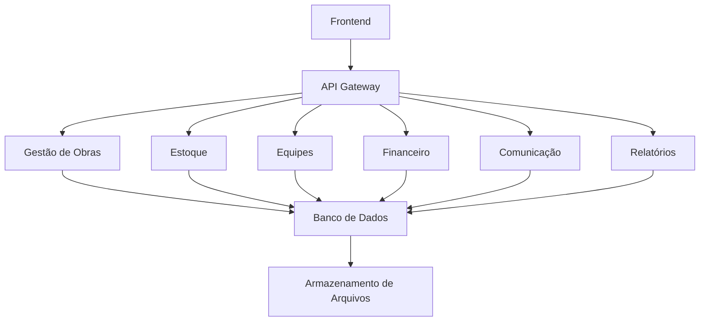

# Sugestão de Arquitetura para Complemento do Sistema de Gestão de Construtora

## Visão Geral
O sistema existente em Node.js será complementado com módulos modulares, mantendo a arquitetura atual. Utilizaremos uma abordagem de microserviços leves dentro do mesmo projeto, com APIs RESTful para integração.

## Estrutura Proposta
- **Backend (Node.js/Express)**: Manter o existente e adicionar endpoints para novos módulos.
- **Banco de Dados**: SQL (PostgreSQL/MySQL) para dados estruturados; considerar MongoDB para uploads de arquivos se necessário.
- **Frontend**: Complementar telas existentes com componentes React/Vue para novos módulos.
- **Autenticação**: JWT ou similar, com roles (Administrador, Mestre de Obras, Almoxarife, etc.).
- **Armazenamento de Arquivos**: AWS S3 ou local para fotos/documentos.
- **Relatórios**: Biblioteca como Puppeteer para geração de PDFs.
- **Notificações**: Email/SMS via serviços como SendGrid/Twilio.

## Módulos
- Gestão de Obras
- Estoque/Almoxarifado
- Equipes e Funcionários
- Financeiro
- Comunicação Interna
- Relatórios

## Integrações
- Cronogramas integrados com financeiro e estoque.
- Alertas automáticos via comunicação interna.
- Relatórios unificados.

## Considerações para Contexto Brasileiro
- Suporte a moedas BRL, datas no formato dd/mm/yyyy.
- Integração com sistemas fiscais (NF-e, etc.) se aplicável.
- Uso offline para canteiro de obras (PWA).
- Interface responsiva para dispositivos móveis.

## Diagrama de Arquitetura (Mermaid)
